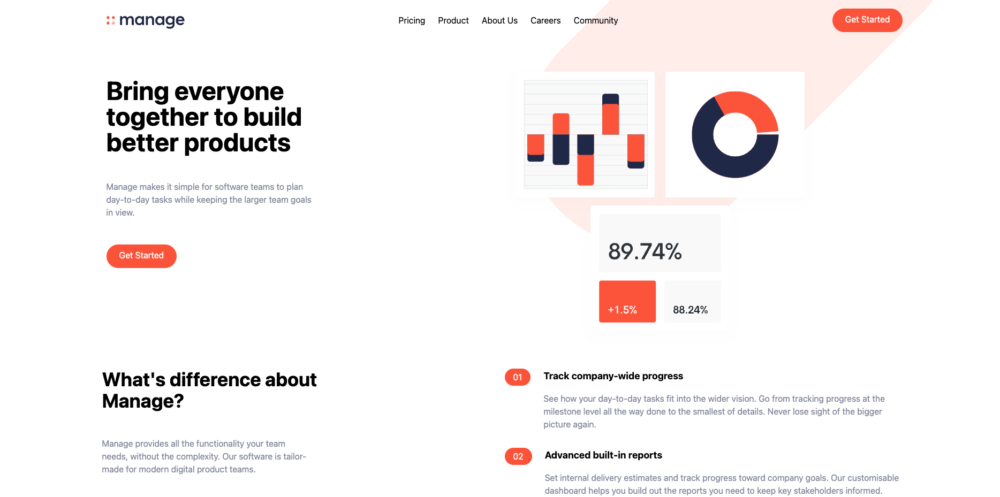

# Frontend Mentor - Manage landing page solution

This is a solution to the [Manage landing page challenge on Frontend Mentor](https://www.frontendmentor.io/challenges/manage-landing-page-SLXqC6P5). Frontend Mentor challenges help you improve your coding skills by building realistic projects.

## Table of contents

- [Overview](#overview)
  - [The challenge](#the-challenge)
  - [Screenshot](#screenshot)
  - [Links](#links)
- [My process](#my-process)
  - [Built with](#built-with)
  - [What I learned](#what-i-learned)
- [Author](#author)

## Overview

### The challenge

Users should be able to:

- View the optimal layout for the site depending on their device's screen size
- See hover states for all interactive elements on the page
- See all testimonials in a horizontal slider
- Receive an error message when the newsletter sign up `form` is submitted if:
  - The `input` field is empty
  - The email address is not formatted correctly

### Screenshot

### Links

- Solution URL: [https://github.com/lawlawson/manage-landing-page](https://github.com/lawlawson/manage-landing-page)
- Live Site URL: [Add live site URL here](https://your-live-site-url.com)

## My process

### Built with

- Semantic HTML5 markup
- CSS custom properties
- Tailwind CSS
- JavaScript
- Swiper
- Mobile-first workflow

### What I learned

The main purpose of this project was to dive into learning how to use Tailwind CSS by creating a responsive mobile first interactive landing page. I also had the opportunity to work with Swiper library to create a carousel for the testimonial section.

## Author

- Website - [https://lawlawson.dev/](https://lawlawson.dev/)
- Frontend Mentor - [@lawlawson](https://www.frontendmentor.io/profile/lawlawson)
- Twitter - [@lawsoncodes](https://www.twitter.com/lawsoncodes)
